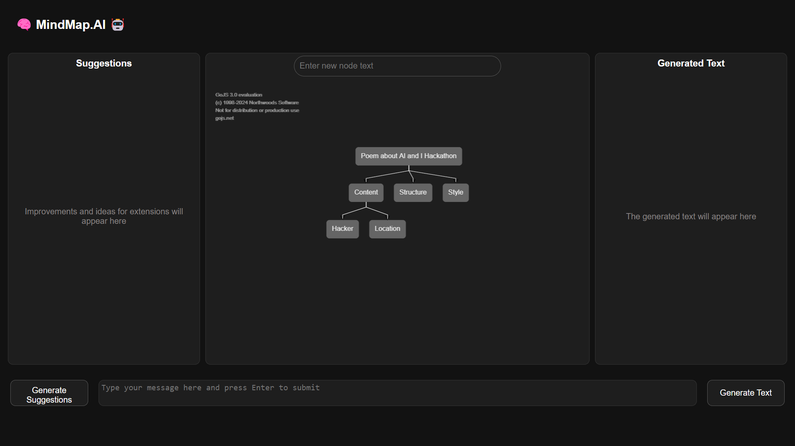

# MindMapAI



This repo is a fork of the AI and I Hackathon: Co-Creativity between Humans and LLMs, organized by fortiss and the partners: Start2 Group, LMU Munich, DFKI, and Humane AI Net.

## Prerequisites

Ensure you have Docker and Docker Compose installed on your machine. You can download them from:
- [Docker](https://www.docker.com/products/docker-desktop)
- [Docker Compose](https://docs.docker.com/compose/install/)

To run locally you will need docker installed!

You also need the following environment variables set:

- `OPENAI_API_KEY` - an OpenAI access key.
- `SSL_KEY` - a valid OpenSSL certificate key
- `SSL_CERTIFICATE` - a valid OpenSSL certificate

Create a .env file where you store your certificates and credentials in the root folder.

1. **Create a directory for the SSL certificate:**

    ```sh
    mkdir certs
    ```

2. **Generate a self-signed SSL certificate and key:**

    ```sh
    openssl req -x509 -nodes -days 365 -newkey rsa:2048 -keyout certs/selfsigned.key -out certs/selfsigned.crt
    ```

In the .env file, you can reference the respective files.

## Project Structure

### Prompts
The prompts for the agents are located inside [task-examples](task_template/app/task_examples/).

### Frontend
The frontend for the hackathon is based on our poetry task, rewritten in ReactJS. The main idea of the task is that the user submits the theme/objective at the of the mindmap and then collaborotively (with AI) extends the mindmap. During the process. From the mindmap, our agent will create a text.

### Model Selection
At the moment, the system supports two models [gpt4-turbo](model_template/models/openAI_model.py) and [gpt4-o](model_template/models/openAI_image_model.py), which is located inside the folder [model_template/models](model_template/models).

You can change between the two models by changing the value of the variable `ai_model` between `OpenAIImageModel()` and `OpenAIModel()` in the file [model_template/model.py](model_template/model.py).

If you have time and want to add your own models to the system, feel free to do so by following the template located in the file [basemodel.py](model_template/models/basemodel.py) and use the already existing model files as guidance.

### Templates
The `task_template` and `model_template` folders contain template applications for deployment on the AI Builder infrastructure.
They indicate how to implement a model and a task and supply most infrastructure necessary to minimise the requirements of a user to adopt their code.
Details are provided in the respective README files.

## Building, Running, and Stopping the Application

### Building the Application

To build the application, run:
```sh
docker compose -f docker-compose_poetry.yaml build
```
from the root directory.


### Building the Application

To run the application, run:

```sh
docker compose -f docker-compose_poetry.yaml up --force-recreate
```
from the root directory.

### Stop the Application

To stop the application, run:

```sh
docker compose -f docker-compose_poetry.yaml down
```
from the root directory.


